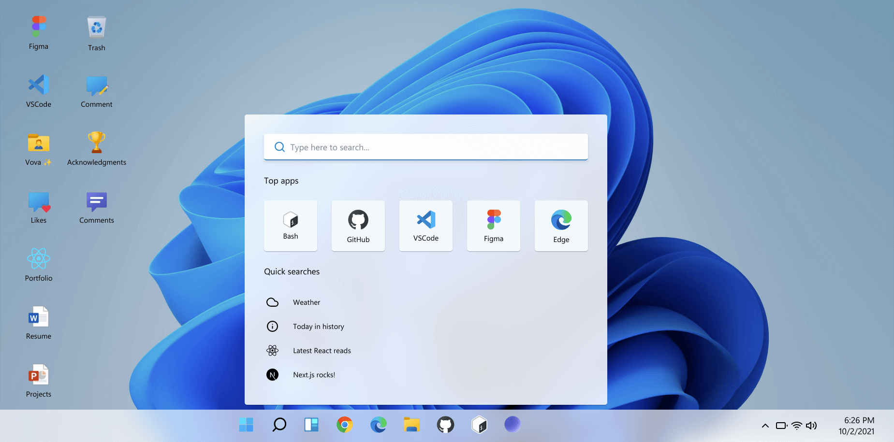

# ✨ Joshua | Portfolio ✨

#### 🔥 Try it online: [https://joshua-david-white.vercel.app/](https://joshua-david-white.vercel.app/)

# Stack

- Frontend: Next.js, React, Redux, TypeScript, Tailwind CSS, Styled-components
- Backend: Node.js, Express, MongoDB, Firebase
- State Management: Redux Toolkit, Zustand
- Web3: Solidity, Ethereum, Web3.js, Hardhat, IPFS, Ethers.js
- Bot Development: Node.js, Python, Telegram API, Discord.js, Chatbot Frameworks (Rasa, Dialogflow)
- Tools & DevOps: Git, Docker, Vercel, CI/CD, Jenkins
- Testing: Jest, Cypress, Mocha
- Other: GraphQL, WebSockets, REST APIs, OAuth2, JWT Authentication

# At glance

## License

⚖️ MIT Copyright (c) 2021 Joshua David
